# Deploying ASP .NET Core MVC Web app using CI and CD in IIS Server from Azure DevOps

This is a .NET Core web app deployed in Azure DevOps from GitHub and published in a IIS Server.
## Create a repository in GitHub
You create repository to host a project. Repositories can contain folders and files, images, videos, spreadsheets, and data sets – anything your project needs. 
1.	Click `click+` in the upper right corner, and then select New repository
2.	Enter the name you want for your project
3.	Add a description, it is not required
4.	Choose between private and public, for most cases like this we use public repository
5.	Add a readme file but if not, you can add it later if you want
6.	Add `.gitignore` file. It is used to ignore all kind of file you don’t want to be included in your repo
7.	Add a `licence`. You can add it later if you want
8.	Click `Create Repository`

## Create an ASP .NET Core MVC Web application

You can create a ASP .NET Core Mvc application with Visual Studio 2017/2019, Visual Studio Code or command prompt with the command `dotnet new mvc`.
I will use Visual Studio 2019.
1.	Select File --> New --> Project --> Create a new project
2.	Select ASP.NET Core Web Application and then select Next.
3.	Enter the name. I entered `DevOps` as name
4.	Select Create
Well run the app in the browser to see if works.

## Add the project in GitHub

Start by initializing your project folder. Open command prompt in projects folder:
1.	`git init` to initialize the git
2.	`git add .` to add all files to the repo
3.	`git commit -m ‘your message’ to commit changes
4.	`git remote add origin https://github.com/[your username]/[your repo].git` to connect with your github repo


5.	`git push -u origin master` push changes to github


 


## Working in Azure DevOps

In Azure DevOps create a new project. After you have created a project need to create a pipeline. Now you have multiple options here but we choose the GitHub yaml option. 
After you have login with your GitHub details you will see all your repository. Select the repository we created before with the Mvc Core template. Follow the steeps Connect --> Select --> Configure --> Review  and add this code at the end of your `.yaml` file:

```
- task: DotNetCoreCLI@2
  inputs:
    command: publish
    publishWebProjects: True
    arguments: '--configuration $(BuildConfiguration) --output $(Build.ArtifactStagingDirectory)'
    zipAfterPublish: True
- task: PublishBuildArtifacts@1
```

Press Save and Run, press again Save and run. After a while a pipeline will be build.

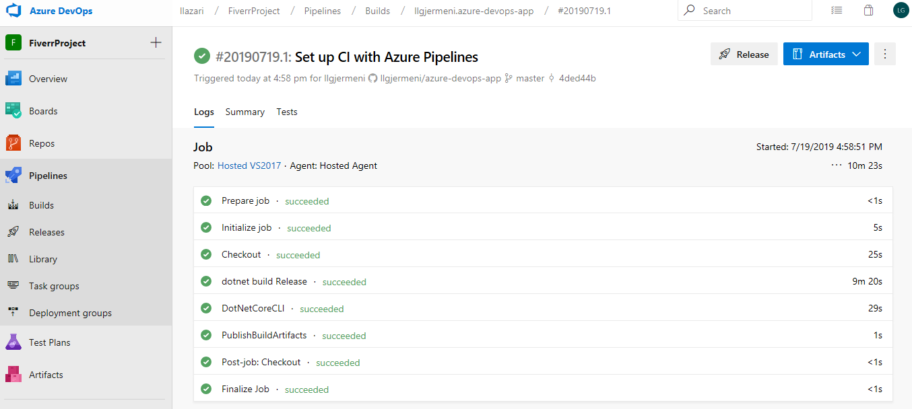
 
### Create a Deployment Group

Now you need to create a Deployment Group

 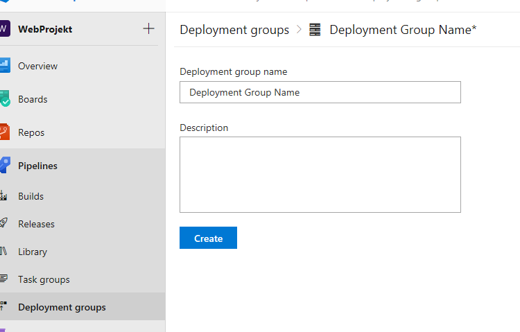
 
Enter a name and a description and click Create. 

 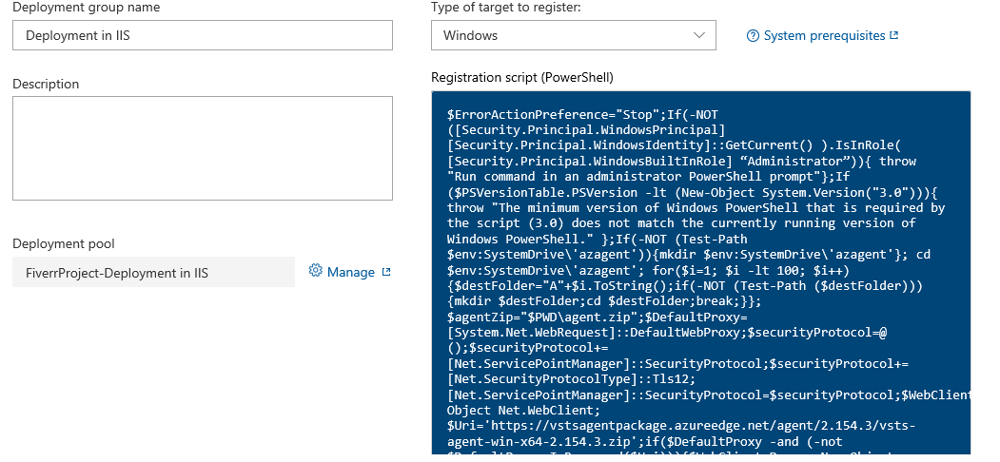

You will see a PowerShell wich you need to copy it but first check the personal access token checkbox. Copy and paste this script in PowerShell, it is a PowerShell script so you need to have installed PowerShell on your machine. Also, you need to add your access token to get authorized in your machine from Azure DevOps. The personal access token can be created by following the steeps: 
1.	Press your icon profile in top right corner of the browser and select the security options.
2.	Press New Token
3.	Enter the token name and check the Full Access checkbox
4.	Press Create and copy the token 
 
 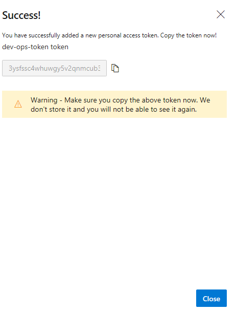

5.	Paste this token on your PowerShell to get authorize
  
Now we to add an agent in your pipeline. Press on Releases button and you will see this image bellow:

 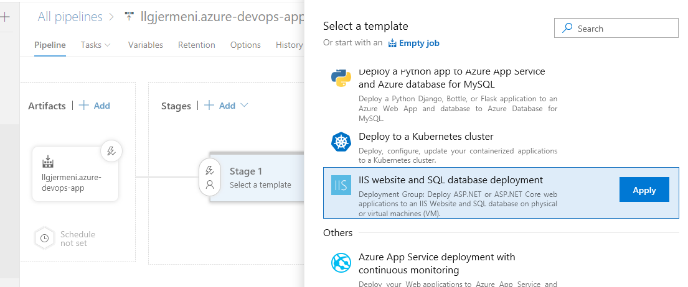

Select the template IIS website and SQL database deployment and press Apply. Name the stage that will show up. In the Artifacts side click the icon in the top right corner and enable the Continues deployment trigger by checking the checkbox Enabled.

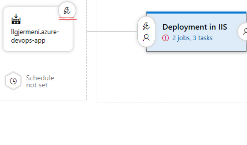
 
Click the Deployment in IIS stage and make the configurations.
First delete the SQL Deployment we are not going to need it.  Now see the image bellow and enter the values that needed. On the IIS Deployment tab first enter the Deployment Group you created before.
 

 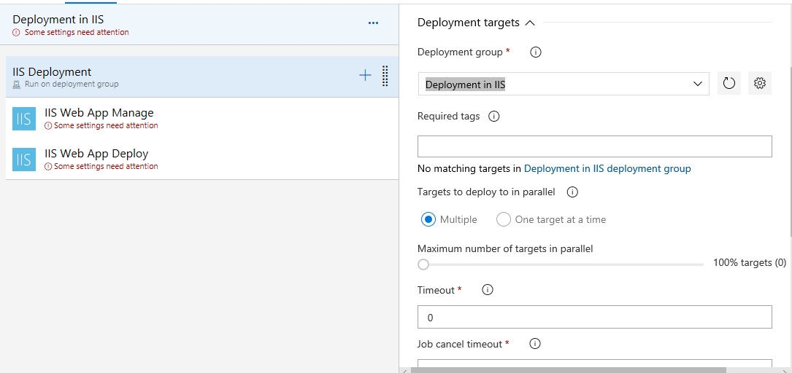

Now press the Deployment in IIS tab wich is your stage enter the Website name and the Application pool name. 
  
  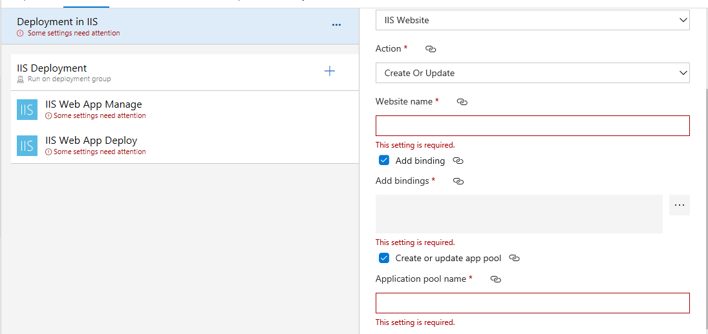

You can find these in your IIS manger in your machine. The default names are Default Web Site and DefaultAppPool.

 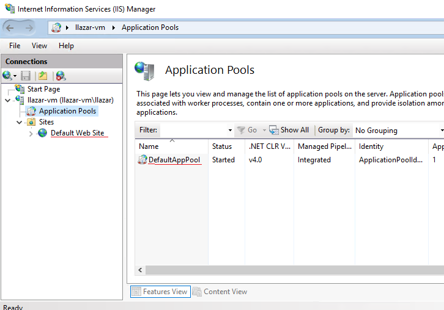
Enter the names and Add bindings press three dots aside, now you need to add the port.
 
  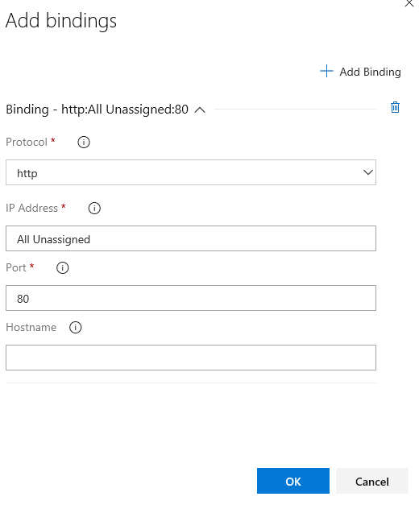
Enter the port 80 and press Ok
Finally click save on the top. But we have not finished yet. We need to create a release and a automatic deployment. On the pipeline tab press create release 
 
  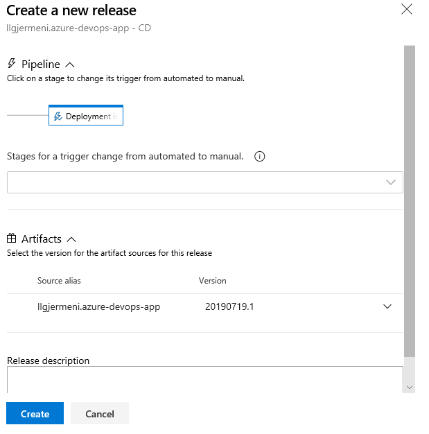

If you done everything right you will see the image above. Press Create and after a while you will see the image bellow.
 
  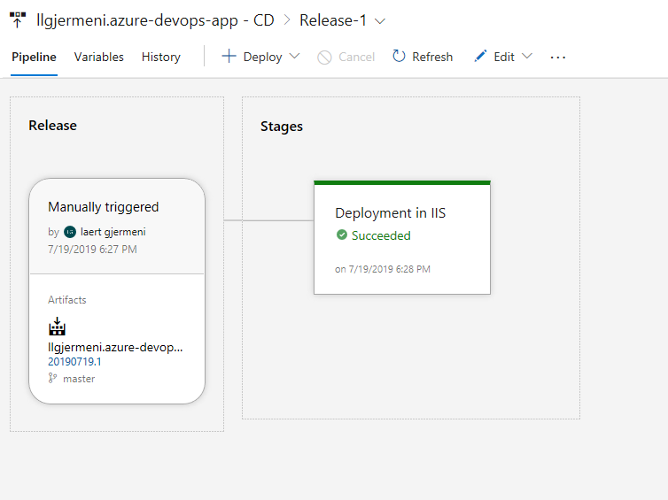

Go to the IIS Manager see and browse the web site.
Check the path folder to see your published files C://inetpub/wwwroot and at the end see the site published in your IIS
 
  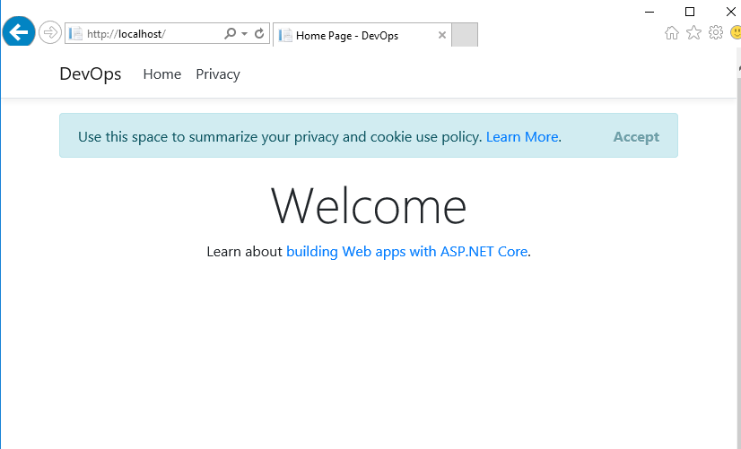
